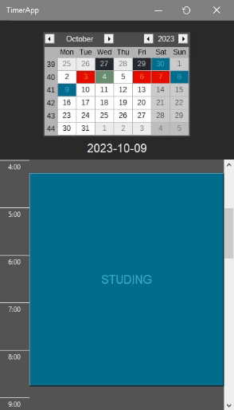

# Calendar

The calendar tab contains a **calendar** in which you can select the date you are interested in and a **list of all events** from the selected day, which is displayed on a list with hourly intervals. Individual **events** are represented by **buttons** (with event activity name and color), which when clicked, open the [event window](../Event/)
