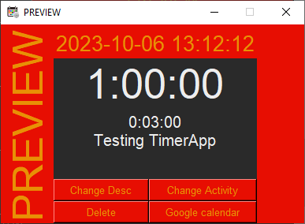
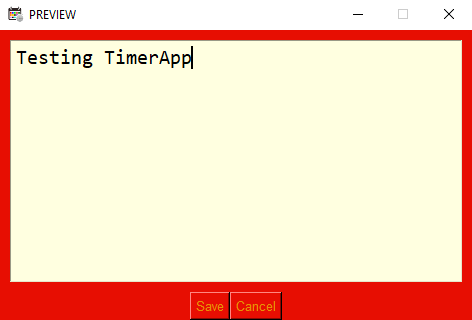
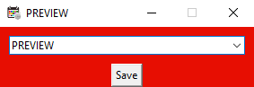

# Event window

Event window opens after selecting an action from the calendar or summary

Event window contains data about the selected action:

- **Start date and time**
- **Duration of the action**
- **Duration of breaks**
- **Description**

... and four buttons that modify data about the selected action:

- **Change Desc**: allows you to change the description of the action

  
- **Change Activity**: allows you to change the activity assigned to the action
  > Activity is selected from the combobox, but if you want to add actions to a new activity, enter its name in the combobox

  
- **Delete**: allows you to completely delete the action
- **Google calendar**: allows you to add events to your google calendar
  > For more information check [here](../GoogleCalendar/) 
