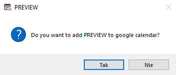
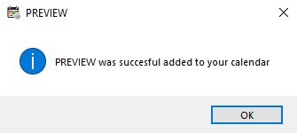

# Google Calendar

### Module is responsible for sending the event to the user's Google calendar

You can add each action manually by pressing button in [event window](../Event/) or enable automatic adding of actions for specific activities in the [settings](../Settings/)

On first use, it asks you to log in to your Google account in a newly opened browser window. After logging in, each subsequent addition will take place without entering a password.
>If you want to delete your login details, you will find such an option in the settings

After clicking yes in the window asking about adding to the calendar, a second window will open confirming the addition. Adding should not take more than a minute