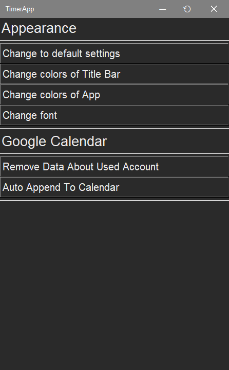
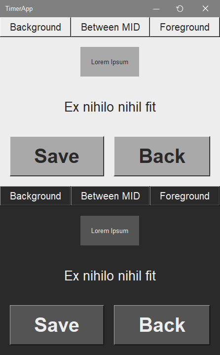
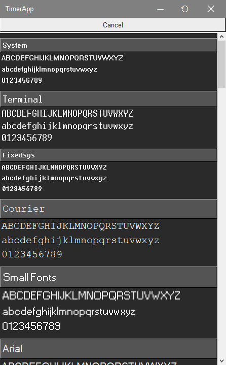
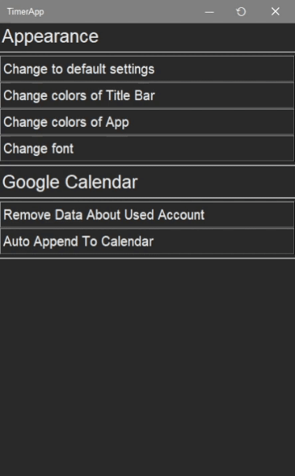

# Settings

In the settings tab you can change [appearance](#appearance) of application or manage adding to [Google calendar](#google-calendar)

## Appearance

- **Change to default settings**: allows you to change all changes made to the appearance to the default ones
- **Change colors of Title Bar**: allows you to change the color of the Title Bar
- **Change colors of App**: allows you to change the colors of the application
  > By clicking the name of the module for which you want to change the color, a color selection field will open, and after clicking the save button, the colors of a specific theme will be changed and saved

  
- **Change font**: allows you to change the font in the application
  
  

## Google Calendar

- **Remove Data About Used Account**: deletes google account login details
- **Auto Append To Calendar**: allows you to select activities for which adding sessions to the Google calendar should be automatic (after saving, you will be automatically asked whether to add action to the Google calendar)

  
