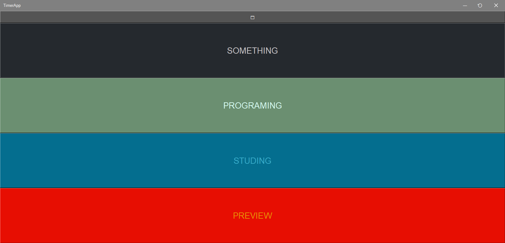
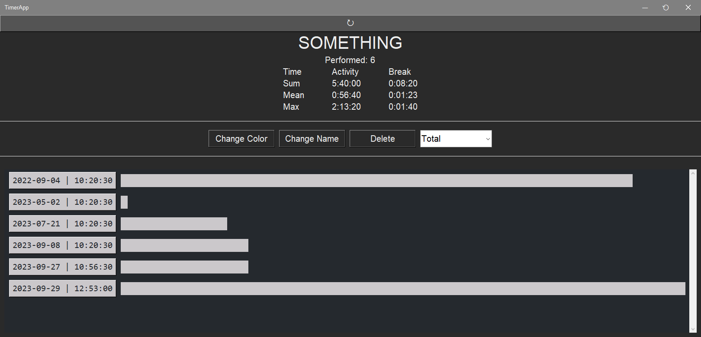
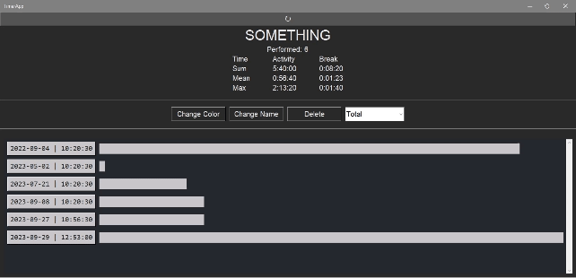

# Summary

Summary consists of two parts:

- [Activity buttons](#activity-buttons)
- [Picked Activity](#picked-activity)

## Activity buttons

It contains:

- **Top button** to change the window size (🗗 or 🗖)

- **List of all activities**: it consists of buttons, each corresponding to a different activity. When clicked, it opens [Picked Activity](#picked-activity)

## Picked Activity

 Generates a page with information about the selected activity

In contains:

- **Top button**: opens [Activity buttons](#activity-buttons) (serves as back button)

- **Quick summary**: contains information about: 
  - How many times the activity was performed
  - How much time it took in total
  - How long it took on average
  - What was the duration of the longest action
  > Quick summary takes into account the selected time period

- **Middle buttons**: modifies the selected activity and the way it is displayed. Contains:
  - **Change color**: allows you to change the color of the activity
  - **Change Name**: allows you to change the name of the activity
  - **Delete**: allows you to delete an activity. 
    > You can also transfer actions from one activity to another this way
  - **Selection of time period**: allows you to select a time range
  

- **List of all actions**: contains all actions from this activity. Each action is represented as:   
  - Button with information about start time and that opens [event window](../Event/) for it
  - Bar indicating duration, with its length being directly proportional to the maximum time spent.
  > List takes into account the selected time period