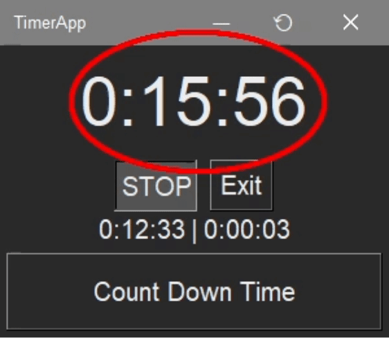
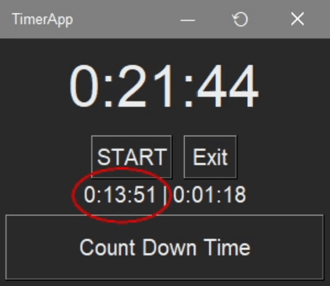
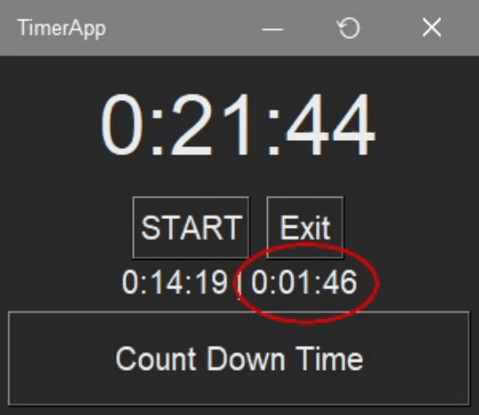
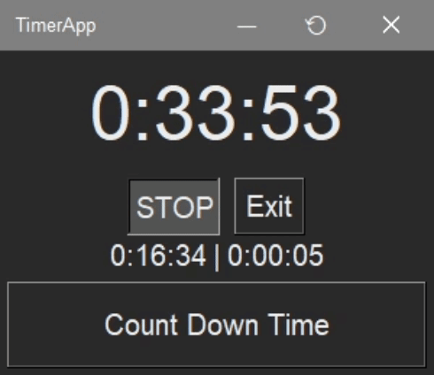
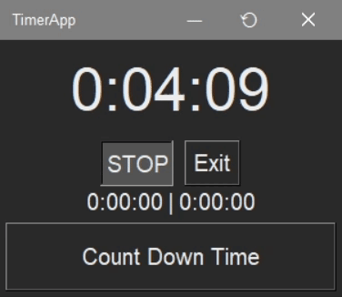
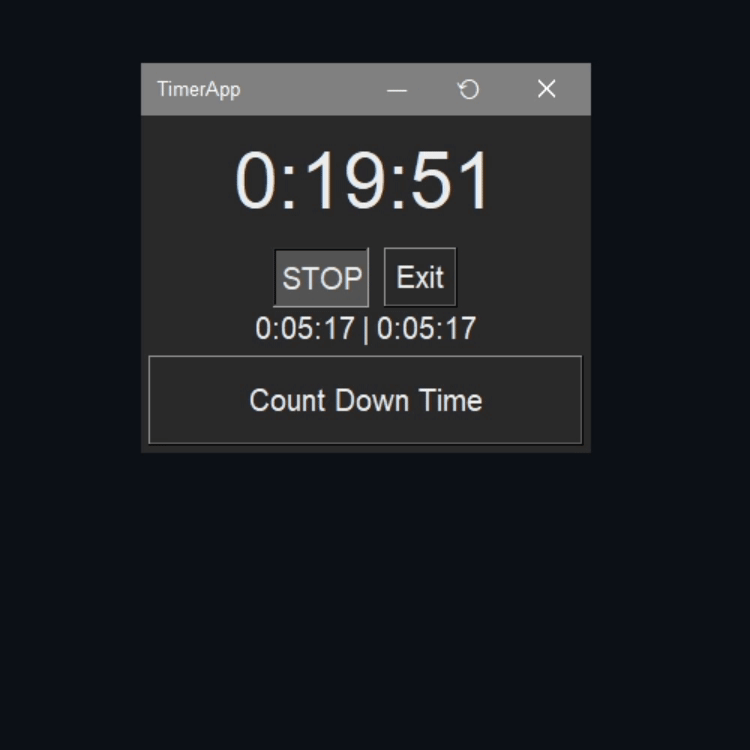
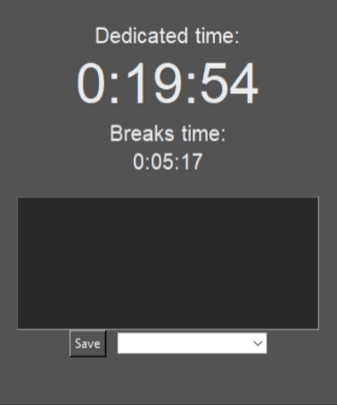
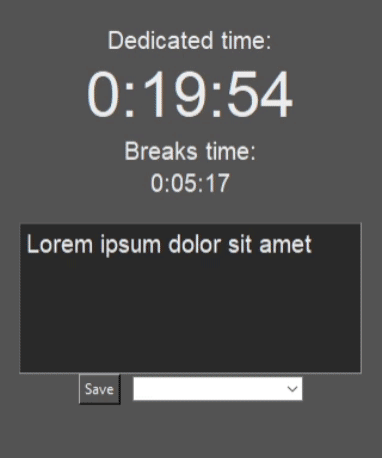

# Timer

Contains:

- **Main** timer:
  Measures duration of activity

  
- **Break** timer:
  Contains sum of durations of all breaks

  
- **Current break** timer:
  Measures duration of current break

  
- **STOP/START** button:
  Defines which timer measures the time

  
- **Count Down Time** button:
  Opens a new window where you can set the countdown time (in minutes), which will then be displayed on the button. When the time expires, a notification sound will be played

  > Clicking the button during the countdown resets the timer

  
- **Exit** button:
  Stops timers, opens Save Your Progres window

  

---

# Save Your Progres

Contains:

- Information about how much time you spent on your activities and breaks

- **Description** field

  
- **Combobox**:
  in which you choose what activity you want to save the actions as

  > If you want to save the actions as a new activity, you can enter a new name in the combobox. 
  
  